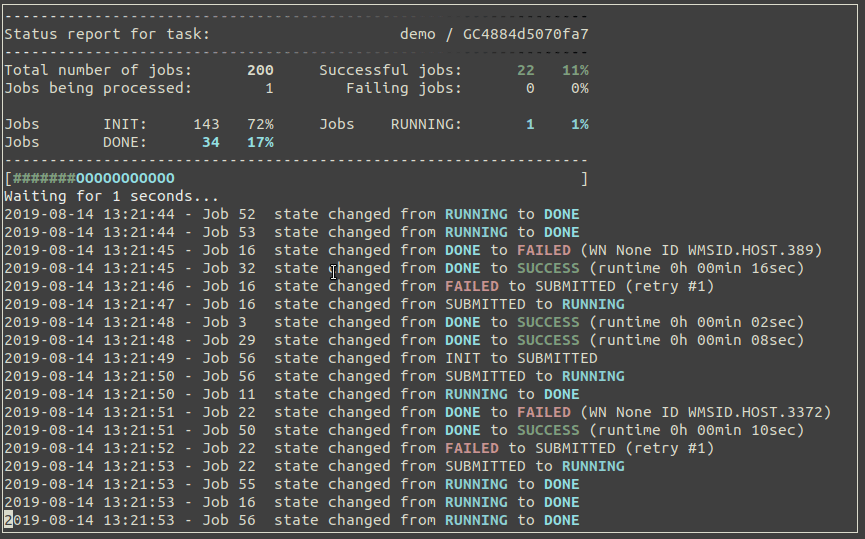

| |PyPI Version| |Build Status| |Coverage| |Landscape| |Gitter|

grid-control
============

*grid-control* is a versatile job submission tool for several different batch systems
and grid middleware.
It supports complex parameterized and dataset based jobs with a convenient way to
specify the parameter space to be processed by the jobs.

Quick HOWTO
-----------

.. code:: sh

    pip install grid-control

For a more instructive introduction, visit the `user's guide`_.

More examples can be found in the `github`_ repository.

Contributing
------------

Base your work on the ``testing`` branch and also use it as the base branch for pull requests.

**Note**: *All branches other than the master branch might be rebased any time.*

.. _github: https://github.com/grid-control/grid-control/tree/testing/docs/examples

.. _user's guide: https://grid-control.github.io

.. |PyPI Version| image:: https://badge.fury.io/py/grid-control.svg
   :target: https://badge.fury.io/py/grid-control
   :alt: Latest PyPI version

.. |Build Status| image:: https://travis-ci.org/grid-control/grid-control.svg?branch=testing
   :target: https://travis-ci.org/grid-control/grid-control
   :alt: Build Status

.. |Coverage| image:: https://codecov.io/github/grid-control/grid-control/coverage.svg?branch=testing
   :target: https://codecov.io/github/grid-control/grid-control?branch=testing

.. |Gitter| image:: https://badges.gitter.im/grid-control/grid-control.svg
   :alt: Join the chat at https://gitter.im/grid-control/grid-control
   :target: https://gitter.im/grid-control/grid-control?utm_source=badge&utm_medium=badge&utm_campaign=pr-badge&utm_content=badge

.. |Landscape| image:: https://landscape.io/github/grid-control/grid-control/testing/landscape.svg?style=flat
   :target: https://landscape.io/github/grid-control/grid-control/testing
   :alt: Code Health
